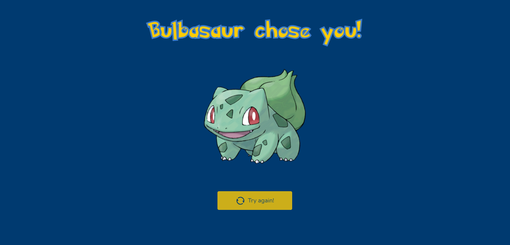

<h1 align="center">
   Get a Pokémon!
</h1>

<p align="center">
  Get a Pokémon! is a different point of view of Pokémon's world. Instead of you choosing a Pokémon, let a Pokémon choose you!
</p>

<p align="center">Project developed during the <strong>Module 3</strong> of <a href="https://reactavancado.com.br/">React Avançado</a></p>

<hr />

<p align="center">In this project, I learned very important concepts from Next.js, like Server Side Rendering, Static Site Generation, CSS Animations, Components, Storybook, Typescript, Axios, Styled Components, Unit Tests and more.
</p>

<div align="center">
  <sub> Made with 💖 by
    <a href="https://github.com/guilhpupo">Guilherme Pupo
  </sub>
</div>

# 📌 Contents

* [Screenshots](#camera-screenshots)
* [Technologies](#rocket-technologies)
* [How to Run](#computer-how-to-run)
* [Commands](#sparkles-commands)
* [Issues](#bug-issues)
* [License](#page_facing_up-license)

# :camera: Screenshots
<div align="center">
   
   
</div>

# :rocket: Technologies
This project was made using the follow technologies:

- [TypeScript](https://www.typescriptlang.org/)
- [NextJS](https://nextjs.org/)
- [Styled Components](https://styled-components.com/)
- [Styled Icons](https://styled-icons.js.org/)
- [Jest](https://jestjs.io/)
- [React Testing Library](https://testing-library.com/docs/react-testing-library/intro)
- [Storybook](https://storybook.js.org/)
- [Eslint](https://eslint.org/)
- [Prettier](https://prettier.io/)
- [Axios](https://github.com/axios/axios)
- [Husky](https://github.com/typicode/husky)


# :computer: How to run

```bash
# Clone Repository
$ git clone https://github.com/guilhpupo/getAPokemon.git && cd getAPokemon
# Install Dependencies
$ yarn install
# Run Aplication
$ yarn dev
```
Go to http://localhost:3000/ to see the application running.

# :sparkles: Commands

- `dev`: runs your application on `localhost:3000`
- `build`: creates the production build version
- `start`: starts a simple server with the build production code
- `lint`: runs the linter in all components and pages
- `test`: runs jest to test all components and pages
- `test:watch`: runs jest in watch mode
- `storybook`: runs storybook on `localhost:6006`
- `build-storybook`: create the build version of storybook
# :bug: Issues

Create a <a href="https://github.com/guilhpupo/getAPokemon/issues">new issue report</a>, it will be an honor to be able to help you solve and further improve our application.
# :page_facing_up: License

This project is under the [MIT License](./LICENSE) |
Made with 💖 by [Guilherme Pupo](https://www.linkedin.com/in/guilhpupo/).
